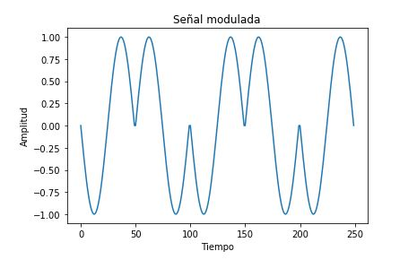
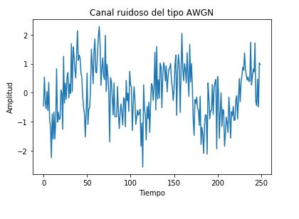
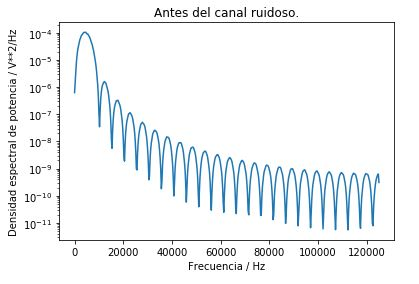
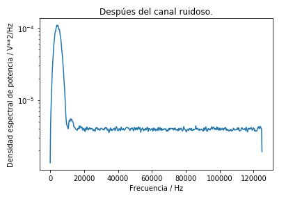
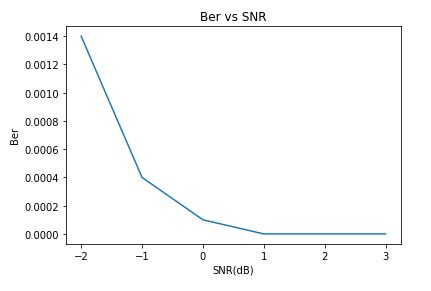

# Universidad de Costa Rica

### Facultad de Ingeniería

### Escuela de Ingeniería Eléctrica

#### IE0405 - Modelos Probabilísticos de Señales y Sistemas

#### Tarea 4

#### Leonel Castro Ulloa; B58219
#### 7 de julio del 2020

#### 1. Crear un esquema de modulación BPSK para los bits presentados. Esto implica asignar una forma de onda sinusoidal normalizada (amplitud unitaria) para cada bit y luego una concatenación de todas estas formas de onda.

Se sabe que la modulación BPSK presenta la cualidad de que al tener un valor de 1 se tiene una señal senoidal y cuando se tiene un valor de 0 se da un desfase de 180 grados en la señal senoidal, por lo tanto para lograr obtener el espema de modulación BPSK inicialmente se establecio la función seno,luego se realiza el recorrido de todos los datos dados en el excel para de esta manera general el siguiente esquema:

#### 2. Calcular la potencia promedio de la señal modulada generada.

La potencia promedio de la señal modulada dio un valor de: 0.4900009800019598

#### 3. Simular un canal ruidoso del tipo AWGN (ruido aditivo blanco gaussiano) con una relación señal a ruido (SNR) desde -2 hasta 3 dB.

Para realizar la simulación de un canal ruidoso del tipo AWGN en un rango de -2 hasta 3 dB, en este caso se mostrara la simulación con un valor de 0 db. Respecto al código lo primero que se realizo fue establecer el valor de SNR, luego se realizo el calculo de la potencia de ruido junto con la desviación estandar de ruido, se prosigue a realizar la señal de ruido con respecto a la señal de ruido creada simulada en el punto 1 del trabajo. Al realizar diferentes pruebas con los direntes valores de del rango se logro observar que la variación entre ellas en muy baja debido a que el sistema tiende a ser muy robusto.
A continuación se mostrara la simulación resultante:

#### 4. Graficar la densidad espectral de potencia de la señal con el método de Welch (SciPy), antes y después del canal ruidoso.
Antes del canal de ruido obtenemos la siguiente grafica de densidad espectral:

Despúes del canal de ruido obtenemos la siguiente grafica de densidad espectral:

#### 5. Demodular y decodificar la señal y hacer un conteo de la tasa de error de bits (BER, bit error rate) para cada nivel SNR.
Al realizar la demoldulación y decodificación de la señal  logramos obtener las siguientes tasas de error para todos los valores de SNR  que van desde -2 hasta 3dB.

Hay un total de 14.0 errores, para una tasa de error de 0.0014 en el dB -2.
Hay un total de 4.0 errores, para una tasa de error de 0.0004 en el dB -1.
Hay un total de 1.0 errores, para una tasa de error de 0.0001 en el dB 0.
Hay un total de 0.0 errores, para una tasa de error de 0.0 en el dB 1.
Hay un total de 0.0 errores, para una tasa de error de 0.0 en el dB 2.
Hay un total de 0.0 errores, para una tasa de error de 0.0 en el dB 3.

#### 6. Graficar BER versus SNR.
A continuación se mostrara una grafica en la cual se comparan los valores de la tasa de error con los respectivos valores de SNR en el rango establecido.

